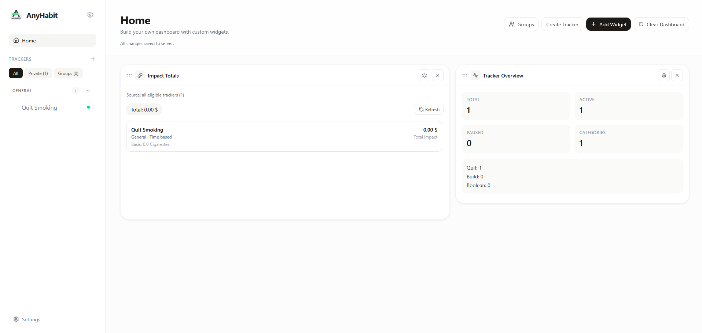

#  AnyHabit

[](https://fastapi.tiangolo.com/)
[](https://react.dev/)
[](https://tailwindcss.com/)
[](https://www.sqlite.org/)
[](https://www.docker.com/)
[](https://discord.gg/ajknBq5zcH)
[](https://sparths.github.io/anyhabit-demo/)

**AnyHabit** is a streamlined, universal habit-tracking dashboard designed for **Raspberry Pi**, home servers, and **Docker** enthusiasts. It provides a minimalist interface to track positive growth or systematically reduce harmful routines.

---

## 📺 Preview & Updates

> [!IMPORTANT]  
> **Try it now:** [Explore the Live Demo Site](https://sparths.github.io/anyhabit-demo/)  
> **Join the Community:** [AnyHabit Discord Server](https://discord.gg/ajknBq5zcH) — Get support, showcase your work, and chat with fellow devs!



<details>
<summary><b>🚀 Click to see Recent Updates (Changelog)</b></summary>

#### [v1.3.0] - Latest Release
- **Added:** Your own time zone — streaks and daily targets now reset at *your* midnight, not UTC midnight
- **Added:** Restore from a backup with a preview of exactly what will change, in Settings → Data
- **Added:** Automatic database snapshot before every upgrade, kept in `data/backups/`
- **Added:** Archive trackers instead of deleting them, keeping all history
- **Added:** Search everything with `Ctrl`/`⌘` + `K`
- **Added:** Tracker descriptions, colours, back-dated start dates and per-log notes
- **Added:** Consistency rate, weekday breakdown and mood-over-time charts
- **Added:** Group renaming, member removal, leaving, deleting and join-code rotation
- **Added:** Change your password, edit your display name, delete your account
- **Added:** Journal search, and relapse entries clearly marked
- **Fixed:** Logging a relapse now actually resets a quit tracker's totals, as documented
- **Fixed:** Export dialog could never open
- **Fixed:** Sign-in page ignored dark mode
- **Fixed:** `ANYHABIT_SECRET_KEY` and the other documented settings were never passed to the backend
- **Fixed:** Signing in failed over plain HTTP on a LAN address (Secure-cookie default)
- **Fixed:** Errors were swallowed silently instead of being shown
- [Full Changelog](https://github.com/Sparths/AnyHabit/compare/v1.2.0...v1.3.0)

#### [v1.2.0] - Data Export
- **Added:** Data Export
- [Full Changelog](https://github.com/Sparths/AnyHabit/compare/v1.1.0...v1.2.0)

#### [v1.0.0] - Multi User
- **Added:** Multi User Support
- [Full Changelog](https://github.com/Sparths/AnyHabit/compare/v0.10.0...v1.0.0)

#### [v0.10.0] - Stand Alone API
- **Added:** Stand Alone API
- [Full Changelog](https://github.com/Sparths/AnyHabit/compare/v0.9.0...v0.10.0)

#### [v0.9.0] - Widgets
- **Added:** Homepage Widgets
- [Full Changelog](https://github.com/Sparths/AnyHabit/compare/v0.8.0...v0.9.0)

#### [v0.8.0] - Habit Scheduling
- **Added:** Flexible Habit Scheduling
- [Full Changelog](https://github.com/Sparths/AnyHabit/compare/v0.7.0...v0.8.0)

#### [v0.7.0] - Refactor App Structure
- **Added:** Refactor app structure, Fix Bugs
- [Full Changelog](https://github.com/Sparths/AnyHabit/compare/v0.6.3...v0.7.0)
</details>

---

## ✨ Key Features

* **Three Tracking Modes:** Quit something, build something, or simply tick a box each period.
* **Your Time Zone:** Days roll over at your midnight, not the server's.
* **Categories & Archive:** Organize with custom categories, and archive finished trackers without losing their history.
* **Accounts & Groups:** Private accounts, plus family/friend groups for shared trackers.
* **Shared Trackers:** Assign group members to one tracker and compare progress per participant.
* **Dual Streaks:** Individual streaks alongside a collective group streak.
* **Real Insight:** Streaks, consistency rate, weekday breakdown, heatmap and mood-over-time charts.
* **Impact Units:** Money saved, Calories, CO₂ avoided, hours reclaimed — you pick the unit.
* **Daily Journal:** Log your mood and thoughts, then search back through them.
* **Safe Upgrades:** The database is snapshotted automatically before any schema change.
* **Fast Navigation:** `Ctrl`/`⌘` + `K` searches trackers, categories and actions.
* **Dark Mode:** Light, dark, or follow your system.
* **Full Data Ownership:** Export trackers and journals as CSV for analysis, or a complete JSON backup you can restore here or on another server.
* **Self-Hosted & Private:** Complete control over your data with SQLite and Docker.

---

## 🚀 One-Command Quick Start

AnyHabit is designed to be "up and running" in seconds. You do **not** need Node.js or Python installed locally.

**Requirements:** [Docker](https://docs.docker.com/get-docker/) with the Compose plugin.

```bash
# 1. Clone the repository
git clone https://github.com/Sparths/AnyHabit.git
cd AnyHabit

# 2. Build and start everything
docker compose up -d --build
```

Open **http://localhost** (or your device's IP) in your browser.

Sign in with the first-run account — username `owner`, password `anyhabit` —
then change the password under **Settings → Account**.

> [!TIP]
> Your data lives in a Docker volume (`db_data`) and survives stopping,
> rebuilding and upgrading the containers. See [Upgrading](#️-upgrading).

---

## ⬆️ Upgrading

```bash
cd AnyHabit
git pull
docker compose up -d --build
```

That is all. Your data lives in a Docker volume, not in the container, and
AnyHabit takes a snapshot of the database into `data/backups/` before applying
any schema change. Migrations are additive and idempotent, so an interrupted
upgrade is safe to retry, and upgrading from any 0.1–0.6 release works the same
way.

> [!TIP]
> Want your own copy first? **Settings → Data → Export data** gives you a JSON
> backup you can restore from **Settings → Data → Restore data** at any time.

See **[UPGRADING.md](UPGRADING.md)** for what changed in 0.7.0, how to verify
the upgrade, and how to roll back if you need to.

---

## ⚙️ Configuration

All settings are optional — AnyHabit runs with sensible defaults. To change any
of them:

```bash
cp .env.example .env   # edit it, then:
docker compose up -d --build
```

| Variable | Description | Default |
| :--- | :--- | :--- |
| `APP_PORT` | Port the app is served on | `80` |
| `ANYHABIT_SECRET_KEY` | Signs login sessions. **Set this** before exposing AnyHabit beyond your own machine (`openssl rand -hex 32`). Changing it only signs everyone out; it never touches data. | built-in dev key |
| `ANYHABIT_COOKIE_SECURE` | `auto` marks the auth cookie Secure only when the request arrived over HTTPS. `true`/`false` force it. | `auto` |
| `ANYHABIT_COOKIE_SAMESITE` | SameSite policy for the auth cookie | `lax` |
| `ANYHABIT_COOKIE_DOMAIN` | Optional domain scope, e.g. `.example.com` | unset |
| `ANYHABIT_TOKEN_TTL_SECONDS` | Session lifetime | `604800` (7 days) |
| `ANYHABIT_BOOTSTRAP_USERNAME` | First-run account username | `owner` |
| `ANYHABIT_BOOTSTRAP_EMAIL` | First-run account email | `owner@anyhabit.local` |
| `ANYHABIT_BOOTSTRAP_PASSWORD` | First-run account password | `anyhabit` |
| `ANYHABIT_AUTO_BACKUP` | Snapshot the database before applying migrations | `true` |
| `ANYHABIT_BACKUP_RETENTION` | How many snapshots to keep | `10` |
| `ANYHABIT_CORS_ORIGINS` | Extra browser origins allowed to call the API | dev server ports |
| `ANYHABIT_LOG_LEVEL` | `DEBUG`, `INFO`, `WARNING` or `ERROR` | `INFO` |
| `VITE_API_URL` | Backend URL when running the frontend separately | unset |

> [!IMPORTANT]
> The first-run account is created **only when the database has no users at
> all**. Changing these values later never modifies an existing account — use
> Settings → Account to change your password.

> [!WARNING]
> Leave `ANYHABIT_COOKIE_SECURE` on `auto` unless you always reach AnyHabit over
> HTTPS. Forcing `true` on a plain-HTTP LAN address makes the browser discard
> the session cookie, which looks exactly like signing in not working.

---

## 🔌 Backend API

AnyHabit is API-first. Everything the web UI does is a documented HTTP call, so
you can build your own client, script your data, or wire it into another tool.

| Resource | Description |
|----------|-------------|
| **[📚 API Documentation](backend/README.md)** | Complete reference with examples |
| **[⚡ Quick Reference](backend/API_QUICK_REFERENCE.md)** | One-page cheat sheet |
| **[🔧 Frontend Integration Guide](backend/FRONTEND_INTEGRATION.md)** | Building a custom frontend |
| **[🗂️ Documentation Index](backend/INDEX.md)** | Navigation hub for backend docs |
| **[💻 Development Guide](backend/DEVELOPMENT.md)** | Running and contributing to the backend |

```bash
# Sign in and keep the session cookie
curl -c cookies.txt -X POST http://localhost/auth/login \
  -H 'Content-Type: application/json' \
  -d '{"identifier":"owner@anyhabit.local","password":"anyhabit"}'

# List your trackers
curl -b cookies.txt http://localhost/trackers/

# Everything about one tracker in a single call
curl -b cookies.txt http://localhost/trackers/1/bundle

# Version, schema version and what the last boot migrated
curl http://localhost/health
```

Interactive docs are served by the app itself —
**[Swagger UI](http://localhost/docs)** · **[ReDoc](http://localhost/redoc)** —
or browse them on the hosted demo:
**[Swagger UI](https://anyhabit.onrender.com/docs)** ·
**[ReDoc](https://anyhabit.onrender.com/redoc)**

---

## 🛠️ Tech Stack

* **Backend:** [FastAPI](https://fastapi.tiangolo.com/) (Python 3.12-slim) + [SQLAlchemy](https://www.sqlalchemy.org/)
* **Frontend:** [React 19](https://react.dev/) + [Vite](https://vitejs.dev/) + [Recharts](https://recharts.org/)
* **Styling:** [Tailwind CSS 4](https://tailwindcss.com/)
* **Database:** [SQLite](https://www.sqlite.org/) in WAL mode, with a built-in migration runner
* **Proxy:** [Nginx](https://www.nginx.com/) as a Reverse Proxy & Static File Server

---

## 🤝 Community & Contributing

AnyHabit is an open-source, community-driven project! 

Join our **[Discord Server](https://discord.gg/ajknBq5zcH)** to:
* 🛠️ Get help with your setup or projects.
* 🚀 Showcase what you've built.
* 💬 Chat with other programmers and contributors.

**Other ways to help:**
* **💡 Ideas:** [Open a Feature Request](https://github.com/Sparths/AnyHabit/issues)
* **🐛 Bugs:** [Open a Bug Report](https://github.com/Sparths/AnyHabit/issues)
* **💻 Code:** Check our [Contributing Guidelines](CONTRIBUTING.md)

## ⭐ Star History

<a href="[https://www.star-history.com/?repos=Sparths%2FAnyHabit&type=date&legend=top-left](https://www.star-history.com/?repos=Sparths%2FAnyHabit&type=date&legend=top-left)">
 <picture>
   <source media="(prefers-color-scheme: dark)" srcset="[https://api.star-history.com/chart?repos=Sparths/AnyHabit&type=date&theme=dark&legend=top-left](https://api.star-history.com/chart?repos=Sparths/AnyHabit&type=date&theme=dark&legend=top-left)" />
   <source media="(prefers-color-scheme: light)" srcset="[https://api.star-history.com/chart?repos=Sparths/AnyHabit&type=date&legend=top-left](https://api.star-history.com/chart?repos=Sparths/AnyHabit&type=date&legend=top-left)" />
   
 </picture>
</a>
